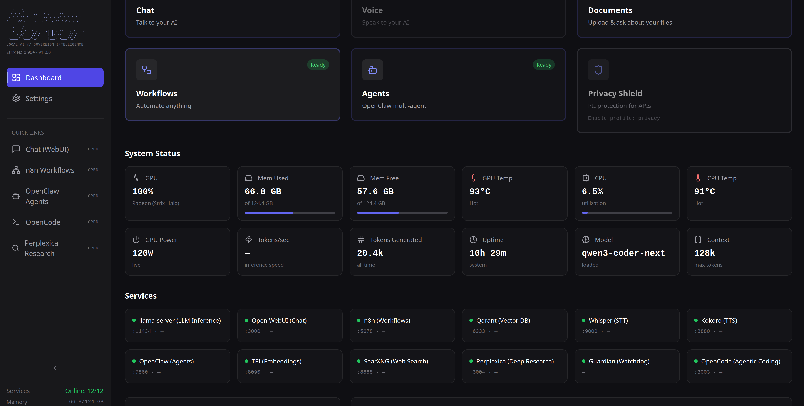
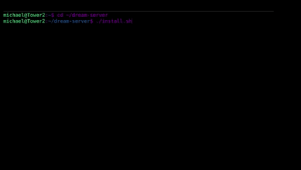
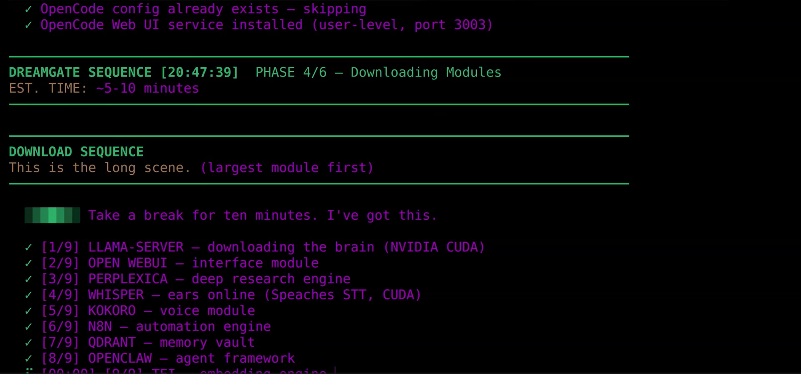

<div align="center">

# Dream Server

### Own your AI. One person, one dream, one machine at a time.

A handful of companies control the vast majority of global AI traffic — and with it, your data, your costs, and your uptime. Every query you send to a centralized provider is business intelligence you don’t own, running on infrastructure you don’t control, priced on terms you can’t negotiate.

If AI is becoming critical infrastructure, it shouldn’t be rented. Self-hosting local AI should be a sovereign human right, not a career choice.

**Dream Server is the exit.** A fully local AI stack — LLM inference, chat, voice, agents, workflows, RAG, image generation, and privacy tools — deployed on your hardware with a single command. No cloud. No subscriptions. No one watching.

[](LICENSE)
[](https://github.com/Light-Heart-Labs/DreamServer/stargazers)
[](https://github.com/Light-Heart-Labs/DreamServer/releases)



[](https://youtu.be/nO8xFNHX-HA)

**New here?** Read the [Friendly Guide](dream-server/docs/HOW-DREAM-SERVER-WORKS.md) or [listen to the audio version](https://open.spotify.com/episode/40MvqJ41bC8cEgvUyOyE3K) — a complete walkthrough of what Dream Server is, how it works, and how to make it your own. No technical background needed.

</div>

---

> **Platform Support — March 2026**
>
> | Platform | Status |
> |----------|--------|
> | **Linux** (NVIDIA + AMD) | **Supported** — install and run today |
> | **Windows** (NVIDIA + AMD) | **Supported** — install and run today |
> | **macOS** (Apple Silicon) | **Supported** — install and run today |
>
> **Tested Linux distros:** Ubuntu 24.04/22.04, Debian 12, Fedora 41+, Arch Linux, CachyOS, openSUSE Tumbleweed. Other distros using apt, dnf, pacman, or zypper should also work — [open an issue](https://github.com/Light-Heart-Labs/DreamServer/issues) if yours doesn't.
>
> **Windows:** Requires Docker Desktop with WSL2 backend. NVIDIA GPUs use Docker GPU passthrough; AMD Strix Halo runs llama-server natively with Vulkan.
>
> **macOS:** Requires Apple Silicon (M1+) and Docker Desktop. llama-server runs natively with Metal GPU acceleration; all other services run in Docker.
>
> See the [Support Matrix](dream-server/docs/SUPPORT-MATRIX.md) for details.

---

## Why Dream Server?

Because running your own AI shouldn't require a CS degree and a weekend of debugging CUDA drivers. Right now, setting up local AI means stitching together a dozen projects, writing Docker configs from scratch, and praying everything talks to each other. Most people give up and go back to paying OpenAI.

We built Dream Server so you don't have to.

- **One command** — detects your GPU, picks the right model, generates credentials, launches everything
- **Chatting in under 2 minutes** — bootstrap mode gives you a working model instantly while your full model downloads in the background
- **13 services, pre-wired** — chat, agents, voice, workflows, search, RAG, image generation, privacy tools. All talking to each other out of the box
- **Fully moddable** — every service is an extension. Drop in a folder, run `dream enable`, done

```bash
curl -fsSL https://raw.githubusercontent.com/Light-Heart-Labs/DreamServer/v2.1.0/dream-server/get-dream-server.sh | bash
```

Open **http://localhost:3000** and start chatting.

> **No GPU?** Dream Server also runs in cloud mode — same full stack, powered by OpenAI/Anthropic/Together APIs instead of local inference:
> ```bash
> ./install.sh --cloud
> ```

> **Port conflicts?** Every port is configurable via environment variables. See [`.env.example`](dream-server/.env.example) for the full list, or override at install time:
> ```bash
> WEBUI_PORT=9090 ./install.sh
> ```

<div align="center">



*The DREAMGATE installer handles everything — GPU detection, model selection, service orchestration.*

</div>

<details>
<summary><b>Manual install (Linux)</b></summary>

```bash
git clone https://github.com/Light-Heart-Labs/DreamServer.git
cd DreamServer/dream-server
./install.sh
```

</details>

<details>
<summary><b>Windows (PowerShell)</b></summary>

Requires [Docker Desktop](https://www.docker.com/products/docker-desktop/) with WSL2 backend enabled.
**Install Docker Desktop first and make sure it is running before you start.**

```powershell
git clone https://github.com/Light-Heart-Labs/DreamServer.git
cd DreamServer
.\install.ps1
```

The installer detects your GPU, picks the right model, generates credentials, starts all services, and creates a Desktop shortcut to the Dashboard. Manage with `.\dream-server\installers\windows\dream.ps1 status`.

</details>

<details>
<summary><b>macOS (Apple Silicon)</b></summary>

Requires Apple Silicon (M1+) and [Docker Desktop](https://www.docker.com/products/docker-desktop/).
**Install Docker Desktop first and make sure it is running before you start.**

```bash
git clone https://github.com/Light-Heart-Labs/DreamServer.git
cd DreamServer/dream-server
./install.sh
```

The installer detects your chip, picks the right model for your unified memory, launches llama-server natively with Metal acceleration, and starts all other services in Docker. Manage with `./dream-macos.sh status`.

See the [macOS Quickstart](dream-server/docs/MACOS-QUICKSTART.md) for details.

</details>

---

## What's In The Box

### Chat & Inference
- **Open WebUI** — full-featured chat interface with conversation history, web search, document upload, and [30+ languages](https://docs.openwebui.com)
- **llama-server** — high-performance LLM inference with continuous batching, auto-selected for your GPU
- **LiteLLM** — API gateway supporting local/cloud/hybrid modes

### Voice
- **Whisper** — speech-to-text
- **Kokoro** — text-to-speech

### Agents & Automation
- **OpenClaw** — autonomous AI agent framework
- **n8n** — workflow automation with 400+ integrations (Slack, email, databases, APIs)

### Knowledge & Search
- **Qdrant** — vector database for retrieval-augmented generation (RAG)
- **SearXNG** — self-hosted web search (no tracking)
- **Perplexica** — deep research engine

### Creative
- **ComfyUI** — node-based image generation

### Privacy & Ops
- **Privacy Shield** — PII scrubbing proxy for API calls
- **Dashboard** — real-time GPU metrics, service health, model management

---

## Hardware Auto-Detection

The installer detects your GPU and picks the optimal model automatically. No manual configuration.

### NVIDIA

| VRAM | Model | Example GPUs |
|------|-------|--------------|
| < 8 GB | Qwen3.5 2B (Q4_K_M) | Any GPU or CPU-only |
| 8–11 GB | Qwen3 8B (Q4_K_M) | RTX 4060 Ti, RTX 3060 12GB |
| 12–20 GB | Qwen3 8B (Q4_K_M) | RTX 3090, RTX 4080 |
| 20–40 GB | Qwen3 14B (Q4_K_M) | RTX 4090, A6000 |
| 40+ GB | Qwen3 30B-A3B (MoE, Q4_K_M) | A100, multi-GPU |
| 90+ GB | Qwen3 Coder Next (80B MoE, Q4_K_M) | Multi-GPU A100/H100 |

### AMD Strix Halo (Unified Memory)

| Unified RAM | Model | Hardware |
|-------------|-------|----------|
| 64–89 GB | Qwen3 30B-A3B (30B MoE) | Ryzen AI MAX+ 395 (64GB) |
| 90+ GB | Qwen3 Coder Next (80B MoE) | Ryzen AI MAX+ 395 (96GB) |

### Apple Silicon (Unified Memory, Metal)

| Unified RAM | Model | Example Hardware |
|-------------|-------|-----------------|
| < 16 GB | Qwen3.5 2B (Q4_K_M) | M1/M2 base (8GB) |
| 16–24 GB | Qwen3 4B (Q4_K_M) | M4 Mac Mini (16GB) |
| 32 GB | Qwen3 8B (Q4_K_M) | M4 Pro Mac Mini, M3 Max MacBook Pro |
| 48 GB | Qwen3 30B-A3B (MoE, Q4_K_M) | M4 Pro (48GB), M2 Max (48GB) |
| 64+ GB | Qwen3 30B-A3B (MoE, Q4_K_M) | M2 Ultra Mac Studio, M4 Max (64GB+) |

Override tier selection: `./install.sh --tier 3`

---

## Bootstrap Mode

No waiting for large downloads. Dream Server uses bootstrap mode by default:

1. Downloads a tiny 1.5B model in under a minute
2. You start chatting immediately
3. The full model downloads in the background
4. Hot-swap to the full model when it's ready — zero downtime

<div align="center">



*The installer pulls all services in parallel. Downloads are resume-capable — interrupted downloads pick up where they left off.*

</div>

Skip bootstrap: `./install.sh --no-bootstrap`

---

## Switching Models

The installer picks a model for your hardware, but you can switch anytime:

```bash
dream model current              # What's running now?
dream model list                 # Show all available tiers
dream model swap T3              # Switch to a different tier
```

If the new model isn't downloaded yet, pre-fetch it first:

```bash
./scripts/pre-download.sh --tier 3    # Download before switching
dream model swap T3                    # Then swap (restarts llama-server)
```

Already have a GGUF you want to use? Drop it in `data/models/`, update `GGUF_FILE` and `LLM_MODEL` in `.env`, and restart:

```bash
docker compose restart llama-server
```

Rollback is automatic — if a new model fails to load, Dream Server reverts to your previous model.

---

## Extensibility

Dream Server is designed to be modded. Every service is an extension — a folder with a `manifest.yaml` and a `compose.yaml`. The dashboard, CLI, health checks, and compose stack all discover extensions automatically.

```
extensions/services/
  my-service/
    manifest.yaml      # Metadata: name, port, health endpoint, GPU backends
    compose.yaml       # Docker Compose fragment (auto-merged into the stack)
```

```bash
dream enable my-service     # Enable it
dream disable my-service    # Disable it
dream list                  # See everything
```

The installer itself is modular — 6 libraries and 13 phases, each in its own file. Want to add a hardware tier, swap a default model, or skip a phase? Edit one file.

[Full extension guide](dream-server/docs/EXTENSIONS.md) | [Installer architecture](dream-server/docs/INSTALLER-ARCHITECTURE.md)

---

## dream-cli

The `dream` CLI manages your entire stack:

```bash
dream status                # Health checks + GPU status
dream list                  # All services and their state
dream logs llm              # Tail logs (aliases: llm, stt, tts)
dream restart [service]     # Restart one or all services
dream start / stop          # Start or stop the stack

dream mode cloud            # Switch to cloud APIs via LiteLLM
dream mode local            # Switch back to local inference
dream mode hybrid           # Local primary, cloud fallback

dream model swap T3         # Switch to a different hardware tier
dream enable n8n            # Enable an extension
dream disable whisper       # Disable one

dream config show           # View .env (secrets masked)
dream preset save gaming    # Snapshot current config
dream preset load gaming    # Restore it
```

---

## How It Compares

Other tools get you part of the way. Dream Server gets you the whole way.

| | Dream Server | Ollama + Open WebUI | LocalAI |
|---|:---:|:---:|:---:|
| **Scope** | Full AI stack — inference to agents to workflows | LLM + chat | LLM only |
| One-command install | Everything, auto-configured | LLM + chat only | LLM only |
| Hardware auto-detect + model selection | NVIDIA + AMD Strix Halo | No | No |
| AMD APU unified memory support | ROCm + llama-server | Partial (Vulkan) | No |
| Autonomous AI agents | OpenClaw | No | No |
| Workflow automation | n8n (400+ integrations) | No | No |
| Voice (STT + TTS) | Whisper + Kokoro | No | No |
| Image generation | ComfyUI | No | No |
| RAG pipeline | Qdrant + embeddings | No | No |
| Extension system | Manifest-based, hot-pluggable | No | No |
| Multi-GPU | Yes (NVIDIA) | Partial | Partial |

---

## Documentation

| | |
|---|---|
| [Quickstart](dream-server/QUICKSTART.md) | Step-by-step install guide with troubleshooting |
| [Hardware Guide](dream-server/docs/HARDWARE-GUIDE.md) | What to buy, tier recommendations |
| [FAQ](dream-server/FAQ.md) | Common questions and configuration |
| [Extensions](dream-server/docs/EXTENSIONS.md) | How to add custom services |
| [Installer Architecture](dream-server/docs/INSTALLER-ARCHITECTURE.md) | Modular installer deep dive |
| [Changelog](dream-server/CHANGELOG.md) | Version history and release notes |
| [Contributing](CONTRIBUTING.md) | How to contribute |

---

## Wall of Heroes

Dream Server exists because people chose to build instead of wait. Every contributor here is part of something bigger than code — a growing resistance against the idea that AI should be rented, gated, and controlled by the few. These are the founders of the sovereign AI movement, proving that one person, one machine, and one dream is enough.

Thanks to [kyuz0](https://github.com/kyuz0) for [amd-strix-halo-toolboxes](https://github.com/kyuz0/amd-strix-halo-toolboxes) — pre-built ROCm containers for Strix Halo that saved us a lot of pain from having to build our own. And to [lhl](https://github.com/lhl) for [strix-halo-testing](https://github.com/lhl/strix-halo-testing) — the foundational Strix Halo AI research and rocWMMA performance work that the broader community builds on.

### Projects that make Dream Server possible

*   [llama.cpp (ggerganov)](https://github.com/ggml-org/llama.cpp) — LLM inference engine
*   [Qwen (Alibaba Cloud)](https://github.com/QwenLM/Qwen) — Default language models
*   [Open WebUI](https://github.com/open-webui/open-webui) — Chat interface
*   [ComfyUI](https://github.com/comfyanonymous/ComfyUI) — Image generation engine
*   [FLUX.1 (Black Forest Labs)](https://github.com/black-forest-labs/flux) — Image generation model
*   [AMD ROCm](https://github.com/ROCm/ROCm) — GPU compute platform
*   [AMD Strix Halo Toolboxes (kyuz0)](https://github.com/kyuz0/amd-strix-halo-toolboxes) — Pre-built ROCm containers for AMD inference
*   [Strix Halo Testing (lhl)](https://github.com/lhl/strix-halo-testing) — Foundational Strix Halo AI research and rocWMMA optimizations
*   [n8n](https://github.com/n8n-io/n8n) — Workflow automation
*   [Qdrant](https://github.com/qdrant/qdrant) — Vector database
*   [SearXNG](https://github.com/searxng/searxng) — Privacy-respecting search
*   [Perplexica](https://github.com/ItzCrazyKns/Perplexica) — AI-powered search
*   [LiteLLM](https://github.com/BerriAI/litellm) — LLM API gateway
*   [Kokoro FastAPI (remsky)](https://github.com/remsky/Kokoro-FastAPI) — Text-to-speech
*   [Speaches](https://github.com/speaches-ai/speaches) — Speech-to-text
*   [Strix Halo Home Lab](https://strixhalo-homelab.d7.wtf/) — Community knowledge base

### The Resistance

*   [Yasin Bursali (yasinBursali)](https://github.com/yasinBursali) — Fixed CI workflow discovery, added dashboard-api router test coverage with security-focused tests (auth enforcement, path traversal protection), documented all 14 undocumented extension services, fixed macOS disk space preflight to check the correct volume for external drive installs, moved embeddings platform override to prevent orphaned service errors when RAG is disabled, fixed macOS portability issues restoring broken Apple Silicon Neural Engine detection (GNU date/grep to POSIX), fixed docker compose failure diagnostic unreachable under pipefail, added stderr warning on manifest parse failure in compose resolver, fixed socket FD leak in dashboard-api, added open-webui health gate to prevent 502 errors during model warmup, hardened ComfyUI with loopback binding and no-new-privileges on both NVIDIA and AMD, fixed Apple Silicon memory limit variable mismatch, added `set -euo pipefail` to the installer catching silent failures, secured OpenCode with loopback binding and auto-generated passwords, added missing external_port_env to token-spy and dashboard manifests fixing hardcoded port resolution, fixed Apple Silicon dashboard to show correct RAM and GPU info using HOST_RAM_GB unified memory override, added VRAM gate fallback for Apple Silicon so features no longer incorrectly show insufficient_vram on unified memory machines, set OLLAMA_PORT=8080 in the macOS compose overlay with GPU_BACKEND=apple alignment, added dynamic port conflict detection from extension manifests on macOS, added cross-platform `_sed_i` helper for BSD/GNU sed compatibility, removed API key from token-spy HTML response replacing it with a sessionStorage-based login overlay, added WSL2 host RAM detection via powershell.exe for correct tier selection, fixed dashboard health checks to treat HTTP 4xx as unhealthy, replaced GNU-only `date +%s%N` with portable `_now_ms()` timestamps across 8 files, fixed COMPOSE_FLAGS word-splitting bugs by converting to arrays, added a macOS readiness sidecar for native llama-server before open-webui starts, added mode-aware compose overlays for litellm/openclaw/perplexica depends_on (local/hybrid only), fixed subprocess leak on client disconnect in setup.py, added Bash 4+ guard with Homebrew re-exec for macOS health checks replacing associative arrays with portable indexed arrays, and added .get() defaults for optional manifest feature fields preventing KeyError on sparse manifests, added Langfuse LLM observability extension (foundation) shipping disabled by default with auto-generated secrets and telemetry suppression, added Bash 4+ guard with portable indexed arrays for macOS health checks, wired LiteLLM to Langfuse with conditional callback activation, removed duplicate network definition in docker-compose.base.yml, fixed macOS llama-server DNS resolution for LiteLLM via extra_hosts, and surfaced manifest YAML parse errors in the dashboard-api status response with narrowed exception handling
*   [latentcollapse (Matt C)](https://github.com/latentcollapse) — Security audit and hardening: OpenClaw localhost binding fix, multi-GPU VRAM detection, AMD dashboard hardening, and the Agent Policy Engine (APE) extension
*   [Igor Lins e Silva (igorls)](https://github.com/igorls) — Stability audit fixing 9 infrastructure bugs: dynamic compose discovery in backup/restore/update scripts, Token Spy persistent storage and connection pool hardening, dotglob rollback fix, systemd auto-resume service correction, removed auth gate from preflight ports endpoint for setup wizard compatibility, added ESLint flat config for the dashboard, cleaned up unused imports and linting across the Python codebase, and resolved CI failures across dashboard and smoke tests
*   [Nino Skopac (NinoSkopac)](https://github.com/NinoSkopac) — Token Spy dashboard improvements: shared metric normalization with parity tests, budget and active session tracking, configurable secure CORS replacing wildcard origins, and DB backend compatibility shim for sidecar migration
*   [Glexy (fullstackdev0110)](https://github.com/fullstackdev0110) — Fixed dream-cli chat port initialization bug, hardened validate.sh environment variable handling with safer quoting and .env parsing, removed all `eval` usage from installer/preflight env parsing, added a safe-env loader (`lib/safe-env.sh`) to prevent shell injection, unified all .env loading across 9 scripts to use `load_env_file()` eliminating duplicated parsers, added dream-cli status-json/config-validate/mode-summary commands, added extension manifest validation with versioned compatibility gating (dream_min/dream_max) for the v2 extension ecosystem, added comprehensive compatibility matrix documentation, added test suites with CI integration for manifest validation, health checks, env validation, and CPU-only path, made session-cleanup.sh portable across macOS/Linux (POSIX grep, stat, numfmt fallback), added --help flag to session-cleanup.sh, and fixed ShellCheck SC2086 warnings and SC2155 errors across health-check.sh, detect-hardware.sh, pre-download.sh, progress.sh, qrcode.sh, migrate-config.sh, llm-cold-storage.sh, session-manager.sh, and 07-devtools.sh
*   [bugman-007](https://github.com/bugman-007) — Parallelized health checks in dream status for 5–10× speedup using async gather with proper timeout handling, benchmark and test scripts, integrated backup/restore commands into dream-cli, added preset import/export with path traversal protection and archive validation, added preset diff command for comparing configurations with secret masking, quarantined broken edge quickstart instructions replacing them with supported cloud mode path, added SHA256 integrity manifests and verification for backups, added restore safety prompts requiring backup ID confirmation, added backup/restore round-trip integration test, added preset compatibility validation before load, added service registry tests to CI, added Python type checking with mypy, added disk space preflight checks to backup/restore with portable size estimation, and added session-level caching to compose flags resolution for performance, expanded dashboard-api test coverage for privacy, updates, and workflow endpoints, added structured logging to agent monitor replacing silent exception swallowing, added bash completion for dream-cli with dynamic backup ID resolution, added automatic pre-update backup with rollback command and health verification, fixed gitleaks CI to use OSS CLI instead of paid license action, added disk space preflight checks to backup/restore, and replaced disabled VAD patch with AST-based Python patcher for safe Whisper voice activity detection
*   [norfrt6-lab](https://github.com/norfrt6-lab) — Replaced 12+ silent exception-swallowing patterns with specific exception types and proper logging, added cross-platform system metrics (macOS/Windows) for uptime, CPU, and RAM, plus Apple Silicon GPU detection via sysctl/vm_stat
*   [boffin-dmytro](https://github.com/boffin-dmytro) — Added SHA256 integrity verification for GGUF model downloads with pre- and post-download checks, corrupt file detection with automatic re-download, fixed model filename casing mismatches, added network timeout hardening across 33+ HTTP operations preventing indefinite hangs, added port conflict and Ollama detection for the Linux installer matching macOS parity, fixed trap handler bugs in installer phases replacing explicit tmpfile cleanup for safe early-exit, added retry logic with error classification and exponential backoff for Docker image pulls, added a GPU detection progress indicator eliminating user anxiety during hardware scans, added Windows zip integrity validation with retry logic, added Docker image pull retry with timeout and post-pull validation via `docker inspect`, added Intel Arc GPU detection and CPU-only default fallback replacing incorrect NVIDIA assumption, added compose stack validation during phase 02 catching syntax errors early, added background process tracking for FLUX model downloads with JSON-based task registry, and improved health check robustness with per-request timeout and adaptive exponential backoff, added unified cross-platform path resolution utilities with POSIX-portable disk space checks, added markdown local link validation for CI, added download robustness with exponential-backoff retry to macOS installer, added configurable health check timeouts to manifest schema solving slow-start services, added SHA256 checksum verification to restore operations with graceful fallback for older backups, added service dependency validation before compose up preventing missing-service failures, added comprehensive manifest schema validator, reduced installed footprint by excluding dev-only files via rsync, added strict error handling ('set -euo pipefail') to operational scripts, added doc link checker to CI, and added rsync progress indicators to backup/restore operations

*   [takutakutakkun0420-hue](https://github.com/takutakutakkun0420-hue) — Added log rotation to all base services preventing unbounded disk growth, and added open-webui startup dependency on llama-server health ensuring the UI never shows a broken state

*   [reo0603](https://github.com/reo0603) — Fixed Makefile paths after dashboard-api move and heredoc quoting bug in session-manager.sh SSH command, narrowed broad exception catches to specific types across dashboard-api, parallelized health checks for 17× faster execution, added compose.local.yaml for dashboard/open-webui/privacy-shield service dependencies, added .dockerignore files to all custom Dockerfiles reducing build context, fixed H2C smuggling vector in nginx proxy and added wss:// for HTTPS in voice agent, added comprehensive extension integration and hardware compatibility test suites, and hardened secret management with .gitignore patterns for key/pem/credential files and SQL identifier validation in token-spy
*   [nt1412](https://github.com/nt1412) — Wired dashboard-api agent metrics to Token Spy with background metrics collection, added TOKEN_SPY_URL/TOKEN_SPY_API_KEY env vars, and fixed missing key_management.py in privacy-shield Dockerfile
*   [evereq](https://github.com/evereq) — Relocated docs/images to resources/docs/images for cleaner monorepo root
*   [championVisionAI](https://github.com/championVisionAI) — Added Alpine Linux (apk) and Void Linux (xbps) package manager support to the installer abstraction layer, hardened hardware detection with JSON output escaping and container/WSL2 detection, rewrote healthcheck.py with retries, HEAD-to-GET fallback, status code matching, and structured JSON output, hardened Docker phase with daemon start/retry logic and compose v1/v2 detection, added cross-platform python3/python command resolution with shared detection utility, and hardened env schema validation with robust .env parsing, enum validation, and line-number error reporting, added sim summary validation test suite with 10 test cases covering help, missing files, invalid JSON, and strict mode, hardened hardware detection with JSON output escaping and container/WSL2 detection, hardened healthcheck.py with retries and HEAD-to-GET fallback, hardened Docker phase with daemon start/retry and compose v1/v2 detection, fixed Windows python3/python command resolution, added extension audit workflow with 838-line Python auditor and 'dream audit' CLI command, added duplicate key detection to env validation, added compact JSON output mode and --help flag to hardware detection, and failed env validation on duplicate keys preventing silent config corruption
*   [Tony363](https://github.com/Tony363) — Hardened service-registry.sh against shell injection in service IDs, narrowed silent exception catches in db.py to specific types, improved PII scrubber with Luhn check for credit card detection and deterministic token round-trip, fixed token-spy settings persistence with atomic writes replacing broken fcntl locking, fixed SSH command injection in session-manager.sh using stdin piping with shlex.quote, narrowed broad exception catches across dashboard-api to specific types with appropriate log levels, and added CLAUDE.md with project instructions and design philosophy

*   [buddy0323](https://github.com/buddy0323) — Ported Windows installer phases 01-07 to native PowerShell decomposing the monolithic script into focused phase files, added Intel Arc SYCL tier map (ARC/ARC_LITE) with docker-compose.intel.yml overlay, detection logic, tier-map tests, and SHA256 verification, added Intel Arc oneAPI SYCL compose overlay with two-stage llama-sycl Dockerfile, added Intel Arc detection checks (lspci, Level Zero runtime, render nodes, group membership), and authored the Intel Arc support matrix documentation and setup guide
*   [blackeagle273](https://github.com/blackeagle273) — Enhanced macOS installer with idempotent .env and config generation preserving existing secrets across re-installs
*   [eva57gr](https://github.com/eva57gr) — Fixed bash syntax error in Token Spy session-manager.sh SSH heredoc command, and unified port contract across installer, schema, compose, and manifests with canonical ports.json registry
*   [cycloarcane](https://github.com/cycloarcane) — Fixed unbound variable crash by guarding service-registry.sh sourcing in install-core.sh, health-check.sh, and 04-requirements.sh
*   [Rowan (rowanbelanger713)](https://github.com/rowanbelanger713) — Enhanced llama-server with configurable batch-size, threads, and parallel request knobs, added TTL caching and async threading to dashboard-api status endpoints, pooled httpx connections for LiteLLM, lazy-loaded React routes with memoized components, scoped CSS transitions to interactive elements, paused polling on hidden tabs, and split Vite output into vendor/icons chunks for faster loading
*   [onyxhat](https://github.com/onyxhat) — Fixed missing variable initialization in installer scripts
If we missed anyone, [open an issue](https://github.com/Light-Heart-Labs/DreamServer/issues). We want to get this right.

---

## License

Apache 2.0 — Use it, modify it, ship it. See [LICENSE](LICENSE).

---

<div align="center">

*Built by [Light Heart Labs](https://github.com/Light-Heart-Labs) and the growing resistance that refuses to rent what should be owned.*

</div>
